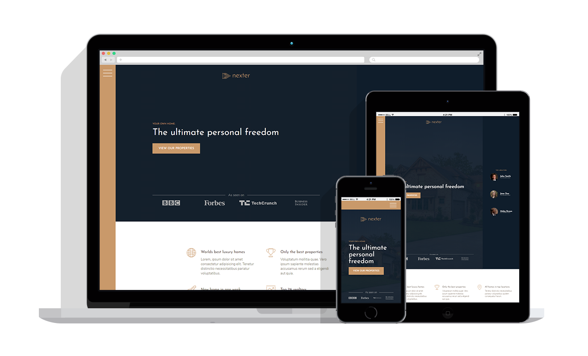

## Nexter

A website made with CSS Grid and flexbox using only HTML and CSS. The last and final project of Advanced CSS and SASS course from [Udemy](https://www.udemy.com/course/advanced-css-and-sass/)

  <a href="https://kien-realtor-site.netlify.com/">Live Demo</a>

  

## 👨‍🎓What I learned:

- How to use effectively CSS Grid to create a beautiful layout that is responsive

## Personal Application:

- Used the CSS grid on my personal portfolio and created a nice flag using React icon to split the summary and title found at www.kien.dev
